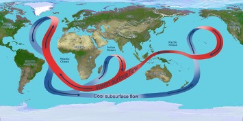

[//]: # (Copyright 2022, !!!Put name here, see repo code examples!!!)
[//]: # (All rights reserved.)
[//]: # (Distributed under the terms of the BSD 3-Clause License.)

## Title of the Project

High-level summary, or short description here. 

## Pages

- [Project Summary](project_summary.md)
- [Progress Reports and Presentations](prog_and_pres.md)
- [Publications](publications.md)
- [Repository](https://github.com/ChaceAshcraft/my_test_wiki_repo/tree/gh-pages)
- [Our Team](team.md)

## Pretty pictures

# Notes

- We may need a copyright, like the ones at the bottom of [this](https://awikner.github.io/actm-umd-tamu-prllc/) and [this](https://jabrams23.github.io/UoE-UW-DARPA/). 
- I included a commented out copyright on our code at the top, I'm not sure if this will be necessary if 
    previous bullet is addressed, but this is how we have been marking code.
- I often put newlines in my Markdown files to keep lines from getting too long, but it isn't necessary.
- I looked into sidebars like [this one](https://awikner.github.io/actm-umd-tamu-prllc/), but didn't see a
    simple way to add it. So, while I think this would be a good thing to add, we might need to later.
- We should probably figure out how to better navigate from page to page (i.e. the sidebar), but for now 
    I've just copied and pasted the links to the different pages on every page. 
